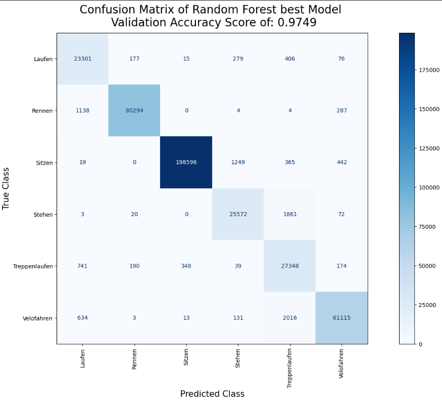

# Sensor based Activity Recognition Dokumentation
Abgabetermin: 16. Juni 2023  
In diesem Repository erfolgt die Dokumentation der Challenge 

Diese Challenge wurde von: Lea Bütler, Manjavy Kirupa, Etienne Roulet und Si Ben Tran bearbeitet.   
Dieses README dient als eine Zusammenfassung aller Arbeiten die im Rahmen dieser Challenge gemacht wurden. Die detailierten Dokumentationen befinden sich in den jeweiligen Notebooks oder README vom entsprechenden Repository und werden hier immer wieder weiter verlinkt. 

## Einleitung
In heutiger Zeit verwenden nahezu alle Personen ein Smartphone, welches mit Beschleunigungs- und Rotationssensoren ausgestattet ist. Ziel dieser Challenge ist es, Bewegungsprofile aus den Daten dieser Sensoren zu identifizieren und durch Verwendung von Machine-Learning-Modellen zu klassifizieren. In dieser Challenge werden sechs verschiedene Bewegungsprofile erfasst und die Sensordaten werden in einem geeigneten Format verarbeitet, um Machine-Learning- sowie Deep-Learning-Modelle zu erstellen. Bei der Verarbeitung der Daten ist es wichtig, das definierte Zeitfenster zu berücksichtigen und darauf zu achten, dass kein "Data Leakage" zwischen den Trainings- und Testdatensätzen stattfindet. Um eine hohe Accuracy Metrik für die Klassifikation zu erreichen, müssen die Modelle durch verschiedene Methoden, wie beispielsweise der Cross-Validation, optimiert werden. Dadurch kann das Ziel einer Accuracy von mehr als 0.9 erreicht werden. 

## Datenerfassung
Die Datenerfassung wurde im Plenum, gruppenübergreifend am 23.02.2023 besprochen. Dabei wurden sechs Bewegungsprofile sowie ein gemeinsames [Konzept zur Datenaufnahme](https://github.com/CDL1-Sensor/Sensor_Dokumentation/tree/master/Datenerhebung) zur Datenaufnahme definiert. 

Nachfolgend werden die sechs Bewegsungsprofilen aufgelistet. 

- Laufen
- Rennen
- Treppenlaufen
- Velofahren
- Stehen
- Sitzen

Damit wir die Bewegungsprofile aufnehmen können, nutzen wir die App [Sensor Logger](https://play.google.com/store/apps/details?id=com.kelvin.sensorapp&hl=de_CH&gl=US) Bei einer Erfassung eines Bewegungsprofiles wird die Messung im App gestartet und das Handy in die rechte Hosentasche gesteckt, anschliessend wartet man ca. 5 Sekunden und beginnt anschliessend mit der eigentlichen Bewegung. Nach Beendigung der Messung wartet man wieder 5 Sekunden ruhig und nimmt anschliessend das Handy wieder in die Hand und beenedet die Messung. Die Messung wird anschliessend als json File nach Etiennes One Drive File "Messung" exportiert. Die Daten wurden im json Format abgespeichert, damit im späteren Verlauf der Challenge das Einlesen der Daten einfacher gestaltet werden kann. Die Messungen fanden im Zeitraum von 23.02.2023 bis 16.03.2023 statt. Alle Messungen die nach dem 16.03.2023 statt gefunden haben wurden in unserer Challenge nicht berücksichtigt. 

Bemerkungen zu den Bewegungsprofilen
- Beim Treppenlaufen unterscheiden wir nicht, ob wir hinauf oder hinunter laufen
- Mit Rennen ist kein Vollsprint gemeint, sondern joggen in unterschiedliche Geschwindigkeiten
- In unserer Gruppe wurden nur .json Dateien berücksichtigt

## Datenverarbeitung 
Nachdem eine [Datenpipeline](https://github.com/CDL1-Sensor/Sensor_Data-Wrangling-und-EDA/tree/master/data_ingestion) erstellt wurde, die uns die aufgenommenen Sensordaten in ein Polardataframe überführt hat, haben wir festgestellt, dass die unterschiedlichen Sensoren, unterschiedlich Startpunkte der Messungeen haben und uns somit viele NA Werte geliefert hat. 

Als Beispiel des Problems hier ein kleiner Beispielausschnitt vom DataFrame.   


Um Daten nicht zu verlieren ersetzten wir die NA Werte mit 0. Zunächst haben wir die Daten getrimmt und aggregiert.
Diese Vorgehensweise dazu findet man detailiert mit Code hier in diesem [Data Wrangling Notebook](https://github.com/CDL1-Sensor/Sensor_Data-Wrangling-und-EDA/blob/master/data-wrangling.ipynb). 

Getrimmt wurden jeweils die ersten und letzen 5 Sekunden der Daten mit der Funktion trim_all_files. Dies wurde gemacht um irrelevanten Daten, wie die Wartezeit von 5 Sekunden bei der Aufnahme, nicht in der weiteren Verarbeitung einzubeziehen.

Die Aggregation erfolgte indem die Daten jeweils in 5 Sekunden Zeitfenster aggregiert wurden. Die Idee besteht darin, Messdaten zu nehmen und diese in gleichgrosse Zeitfenster zu unterteilen. In jedem Zeitfenster werden dann die Sensorwerte mithilfe von Aggregationsfunktionen wie dem Durchschnitt, Median, Minimum oder Maximum berechnet. Wobei es wichtig ist, dass die Frequenz der Sensorwerte in allen Datensätzen gleich bleibt, insbesondere beim Rolling Mean. Dies bedeutet, dass die Anzahl der Beobachtungen pro Sekunde konsistent sein sollte, um genaue Ergebnisse zu gewährleisten.

Um die Daten für das Machine Learning zu brauchen, wurden diese preprocessed. Dabei wurden die Daten hauptsächlich in Train und Validation Set gesplittet. Zunächst wurden mit undersampling oder oversampling die Test sowie Validierungsdaten anhand von Plots verglichen. 


## Explorative Datenanalyse

Gesammthaft wurden 303 Mesuungen gemacht.

Im [Notebook der explorativen Datenanalyse](https://github.com/CDL1-Sensor/Sensor_Data-Wrangling-und-EDA/blob/master/eda.ipynb) wurden vorallem Visualisierungen generiert und die Daten zu verstehen. Zu Beginn wurden die Anzahl Messungen pro Person und Bewegungsprofile geplottet. Danach wurden die Sensoren mit Boxplots dargestellt. Um mehr über einzelne User zu erfahren, haben wir Sensordaten zweier User verglichen. Zu guter letzt wurden auch alle Sensordaten anhand von [Linienplots](https://github.com/CDL1-Sensor/Sensor_Data-Wrangling-und-EDA/tree/master/plots/raw-vs-trimmed) dargestellt. Dies jeweils für jeden Sensor einmal auf den unbearbeiteten Daten und einmal auf den getrimmten Daten.

Weitere Einsichten gewannen wir indem wir ein pandasprofiling als Inspiration auf unsere Daten gemacht haben. Hierfür wurde ein separates [Notebook EDA pandansprofiling inspiration](https://github.com/CDL1-Sensor/Sensor_Data-Wrangling-und-EDA/blob/master/eda-pandasprofiling-inspiration.ipynb) generiert. 

Wichtig zu erwähnen ist, dass die Marke vom Handy durchaus einen Einfluss auf die Datenqualität aufweist. 
Smartphones die tendenziell moderner und teuer sind, sind entsprechend besser ausgerüstet. 

Da bei der Modellierung wir alle Smartphone Modelle berücksichgt haben, sollte dies zu keinen Problemen bei den Validierungsdaten oder Testdaten führen. 

## Backend App

- Das Backend wird nur für React Native verwendet (Experimental):
https://github.com/CDL1-Sensor/activity_frontend

- Für das Produktive https://github.com/CDL1-Sensor/Mobile-Frontend wird local Tensorflow JS verwendet.

Repo (Backend):
https://github.com/CDL1-Sensor/Backend_App

## Machine Learning Modelle

### Logistische Regression - Baseline Modell

Als Baseline Modell haben wir eine Logsitische Regression genommen, die mehrere Klassen vorhersagen kann. 
In Sklearn wird die multiclass Logistische Regression durch das One-vs-Rest-Schema (auch als One-vs-All-Schema bezeichnet) implementiert. Das bedeutet, dass die Logistische Regression für jede Klasse eine separate binäre Klassifikation durchführt, indem sie die eine Klasse gegen alle anderen Klassen klassifiziert. Das Ergebnis dieser binären Klassifikationen wird dann kombiniert, um die endgültige multiklassifizierte Vorhersage zu erzeugen.
Beim Baseline Modell wurden die Rohdaten, sprich unverarbeitet eingelesen und der Datensatz aufgrund der niedrigsten Anzahl vorhandenem Bewegungsprofil gleichmässig gesampelt. Der Grund für diese Verarbeitung ist, dass wir als Optimierungsmetrik die Accuracy haben. Anschliessend wurden die Daten in Trainings und Validierungsdaten aufgesplittet in einem Verhältnis von 80:20. Anschliessend wurde das Logistische Modell trainiert und mittels den Validierungsdaten evaluiert, sprich die Accaurcy sowie die Konfusionsmatrix berechnet und geplottet. 


### Decision Tree

Unser erstes Machine Learning Modell ist ein Decision Tree Classifier. Damit wir das trainieren der Modelle verfolgen konnten, haben wir die Hyperparamater Tuning sowie Cross Validation mit Weights and Bias durchgeführt. Dabei haben wir verschiedene Parameterkombinationen des Decision Tree sowie auch das Under- und Oversampling ausprobiert und haben dabei festgestellt, dass die Accuracy bzw. alle Metriken stark vom Train Test Split abhängen. Anschliessend haben wir die besten Hyperparameter genommen und diese mehrmals mit unterschiedlichen random_state Split von Train und Test trainiert und konnten somit eine Fehlerabschätzung der Metriken berechnen.  
Alle Runs sind hier ersichtlich: [Decision Tree W&B](https://wandb.ai/fhnw-cdl1/01-decision-tree)   
Gesamthaft wurden 6101 Runs vom Decision Tree gemacht.    
Der Beste Run den wir mit dem Decision Tree Classifier erreichen konnten.


Wir erkennen bei der Konfusion Matrix deutlich, dass unser Decision Tree Treppenlaufen als Laufen prediziert. Eine mögliche Erklärung ist, dass beim Treppenlaufen Plateaus vorhanden waren und die Datenqualität von Treppenlaufen somit eine Mischung aus Treppenlaufen und Laufen besteht. 

Vom besten Modell wurde eine Fehlerabschätzung der Metrik gemacht, dabei wird der Mittelwert und die Standardawbeichung der jeweiligen Metrik über dem Balken geplottet. Wir erkennen hier, dass unsere Accuracy Validation einen Mittelwert von 0.73 erreicht. 


### Random Forest

Ein erweiterte Ansatz vom Decision Tree Modell ist unser Random Forest Model. Auch beim Random Forest haben wir die Hyperparameter Tuning sowie Cross Validation mit Weights and Bias durchgeführt und auch hier festgestellt, dass der Split von Train und Test einen grossen Einfluss hat. Beim Random Forest konnten wir tendenziell bessere Scores verzeichnen als beim Decision Tree. 

Alle Runs vom Random Forest Modell sind hier ersichtlich: [Random Forest W&B](https://wandb.ai/fhnw-cdl1/02-random-forest)   
Gesmthaft wurden 3609 Random Forest Modelle erstellt und die höchste Accuracy die wir erreichen konnte lag bei 0.97.



Die Vermutung, dass der Random Forest besser performd als Decision Tree sehen wir bei der Fehlerabschätzung.
Hier konnten wir von unserem besten Random Forest Modell eine Accuracy Validation von 0.81 verzeichnen.   
In der Confusion Matrix sehen wir, dass der Random Forest Velofahren als Treppenlaufen predicted. 


Es ist auch hier, wie beim Decision Tree, stark zu erkännen, dass die Standardabweichung relativ gross ist bei den Validierungsdaten als beim Trainingsdatensatz. 

### Stochastic Gradient Descent

Ein weiter ML Ansatz den wir verfolgt haben war der Stochastic Gradient Descent Classifier. Analog wie beim Decision Tree und Random Forest, wurden die Hyperparameter Tuning ebenfalls in Weights & Bias gemacht. Die Laufzeit eines Run war dabei stark abhängig vom Split, so konnten nicht so viele Runs getätigt werden wie beim Decision Tree und Random Forest. Gesamthaft wurden 490 Runs gemacht, wobei der beste Run eine ähnliche hohe Accuracy, wie der Decision Tree erreichen konnte. 


Bei der Fehlerabschätzung hat sich jedoch herausgestellt, dass der Stochastic Gradient Descent als schlechteste performt. 


### Vergleich der ML Modelle

Vergleichen wir alle unsere Machine Learning Modelle mit den erreichten Metriken sowie deren Fehlerabschätzung, so hat unser Random Forest Modell am besten performd. 


### Weitere ML Ansätze

Weitere fehlgeschalegene ML Ansätze die wir ebenfalls versucht haben waren:

- KNN 
- SVM


## Deep Learning Modelle

Repo: https://github.com/CDL1-Sensor/Sensor_Klassifikation-mit-Deep-Learning
Exported Model: https://github.com/CDL1-Sensor/Sensor_Klassifikation-mit-Deep-Learning/tree/main/saved_model/sensor_model

Tabellarische Auflistung aller DL-Modelle und deren Parameter

| DL-Modell | Anzahl CNN Layer | CNN Filter Size | Kernel Size | Aktivierungsfunktion | L2-Regularisierung | Dropout | Anzahl LSTM Layer | LSTM Neuronen | Anzahl Dense Layer | Dense Neuronen | 
| --- | --- | --- | --- | --- | --- | --- | --- | --- | --- | --- |
| 01 | 1 | 64 | 2 | relu | 0.01 | - | 1 | 100 | 1 | 6 | 
| 02 | 1 | 64 | 4 | relu | 0.01 | 0.2 | 1 | 100 | 1 | 6 |  
| 03 | 1 | 32 | 2 | relu | 0.01 | - | 1 | 100 | 1 | 6 | 
| 04 | 1 | 64 | 2 | relu | 0.01 | - | 1 | 100 | 1 | 6 | 
| 05 | 3 | (32,20,10) | 2 | relu | 0.01 | - | - | - | 3 | (180,100,6) | 
| 06 | 2 | (64,32) | 2 | relu | 0.01 | - | - | - | 4 | (200,100,50,6) | 
| 07 | 5 | (64,64,64,64,64) | 2 | relu | 0.05 | - | - | - | 6 | (200,150,100,50,25,6)

Baseline Model:
``` python
# Baseline Model
def create_baseline_model(name="baseline_model"):
    model = tf.keras.Sequential(
        [
            tf.keras.layers.Flatten(input_shape=(timesteps, n_features)),
            tf.keras.layers.Dense(6, activation="softmax")
        ],
        name=name
    )
    model.compile(
        optimizer="adam",
        loss="categorical_crossentropy",
        metrics=["accuracy", tf.keras.metrics.Precision(), tf.keras.metrics.Recall()]
    )
    return model
```

Bestes Model nach Metriken: Model 3 berechnung: prec + recall + acc
Bestes Model nach Evalutations Daten: Model 1

[[todo]]: Unterschiede erklären von verschiednen Modellen


### Hyperparameter optimierung

#### Manuelle Hyperparameter Optimierung:
Einige Hyperparameter wurden Manuell bestummen, da das training der Daten bereits zeitlich intensive ist mit den gefundenen best Werten.

1. Window size
Versuche:
  window_size = 100
  window_size = 200
  window_size = 400
Als bester Wert wurde manuell in verschiedenen Jupyter Notebooks Experimentell bestummen
<br>
2. Step size
Versuche: 
  step_size = 100
  step_size = 50
  step_size = 10
Als bester Wert wurde in den Experimenten als 10 festgelegt.
Bei den anderen Werten, war das overfitting der Daten sehr fortgeschritten, so wurde bei der 100 stepsize bei der Validation der unseen Data nur ~3 Klassen richtig klassifizert.
<br>
3. Batch_size
Versuche:
  batch_size = 128
  batch_size = 64
  batch_size = 32
Es wurde 64 genommen, da mit der RTX 3080 GPU die beste Performance erreicht werden konnte.
<br>
4. data_augmentation
Versuche:
  on = true
  on = false
Schlussendlich wurde das Data Augumentation nicht verendet da es den Trainingsprozess extrem in die länge zieht und nur ein kleiner Gewinn dabei war. (Zeitgründe)
<br>
5. Epochen
Versuche:
  epochs = 6
  epochs = 10
  epochs = 20
  epochs = 25
Ab 20 Epochen wurde der Aufwand zu gross für den marginalen Gewinn.

#### Automatisierte Hyperparameter Optimierung:
Es wurden 7 Modelle erstellt plus Baseline (siehe Tabelle oben). Mit jeweils 2 verschiedenen Architekturen (CNN/ CNN&LSTM). 

Dabei wurde folgende Hyperparameter beachtet:
- Filtersize
- kernel_size
- padding
- kernel_regularizer
- LSTM

### Auswertung:
Das grosse Problem der Daten ist, dass es zu wenige Daten gibt um allgemein klassfiziern zu können. Neue ganze Messreihen, die noch nie von dem Model trainiert wurden können meist nicht klassifizert werden und wir overfitten zu stark auf die beschränkten Daten die wir haben. Wir müssten mehr Diversität in den Daten haben, mehr Personen, verschiedene Handys. Denn schon Hosen machen einen Unterschied, beispielsweise bei Jeans, ist das Handy immer statisch am Körper. Hat man eine lockere Sporthose an, so bewegt sich das Handy extreme in der Hose.
Um bessere Klassifikation machen zu können benötigt es scheinbar weitaus mehr Daten als wir aufgenommen hatten. Für die Validation wurden die Daten auch etwas knapp. Denn wir mussten ganze Messversuche haben, die noch nie mit dem Modell in berührung kamen. Hätte man mehr Daten, könnte man die auch beim Trainieren direkt verwenden --> Train, Test, Validation Split.

Dennoch konnten wir mit etlichen Modellen ein einigermassen gutes Modell aufstellen, dass auch auf Allgemeine Daten reagieren kann.

### Tensorboard
run Tenorboard with:
``` bash
tensorboard --logdir logs
```

### Bestes Modell:
``` python
def create_model_1(name="model_1"):
    '''
    CNN Model with 1 Convolutional Layer, 1 LSTM Layer and 1 Dense Layer 
    '''
    model = tf.keras.Sequential(
        [
            # Add a 1D convolutional layer
            tf.keras.layers.Conv1D(
                filters=64,
                kernel_size=12,
                activation="relu",
                padding="same",
                input_shape=(timesteps, n_features),
                kernel_regularizer=tf.keras.regularizers.l2(0.01),
            ),
            # Add LSTM layer
            tf.keras.layers.LSTM(100),
            # Add a dense output layer
            tf.keras.layers.Dense(
                6, activation="softmax"
            ),  # Change activation function based on the nature of the output
        ],
        name=name,
    )
    model.compile(
        optimizer="adam",
        loss="categorical_crossentropy",
        metrics=["accuracy", tf.keras.metrics.Precision(), tf.keras.metrics.Recall()],
    )
    return model

```


### Klassifikations Matrix Bestes Modell:


### Vergleich Deep Learning mit Machine Learning 
Das Interessante ist, dass die Metriken wie Accuracy und Recall/Precision täuschen. Denn wie man hier erkenne kann:


Ist das Modell 2 mit einer Trainingsgenauigkeit von 99,76% und einer Validierungsgenauigkeit von 99,70% in der Metrik höher als das beste Modell mit einer Validierungsgenauigkeit von 98,03% und einer Trainingsgenauigkeit von 98,08%?

Jedoch, wenn man sich die komplett ungesehenen Daten nimmt (siehe Notebook: https://github.com/CDL1-Sensor/Sensor_Klassifikation-mit-Deep-Learning/blob/50605b0ce4e453b72d90a9d83cbfd9b2f0f82372/DL-Modelle.ipynb#L15) und alle Modelle einliest und vorhersagt, um das beste Modell anhand dieser unbekannten Daten zu ermitteln, zeigt sich, dass die Modelle Overfitting auf die Trainings- und Testdaten aufweisen und die Vorhersage für völlig neue Daten schlechter ist.


---


# Mobile App / Frontend Tensorflowjs:
- Repo Test: https://github.com/CDL1-Sensor/Mobile-Frontend
- Repo Prod: https://github.com/etiiiR/Mobile-Frontend
- URL: https://activity-recognition.netlify.app

Nur das Repo im Account etiiiR wird mittels CI/CD Pipeline automatisch mittels Git Pushes auf Netlify Deployed. <br>
Dies hat den Zweck, dass das Repo per Fork jeweils resynced wird um einen Deploy zumachen.
Damit kann es verhindert werden, ohne Github Lizenz, nicht in das Prod zu pushen.
Was die Fehler anfaelligkeit minimiert.
**Installation** siehe Readme.md
## Reactivity:
Es wird auf folgende Javascript Objects reactive reagiert.
``` js
watch(
  () => ({
    alpha: orientation.alpha,
    beta: orientation.beta,
    gamma: orientation.gamma,
    x: motion.acceleration?.x,
    y: motion.acceleration?.y,
    z: motion.acceleration?.z,
    gx: motion.accelerationIncludingGravity?.x,
    gy: motion.accelerationIncludingGravity?.y,
    gz: motion.accelerationIncludingGravity?.z,
    rx: motion.rotationRate?.alpha,
    ry: motion.rotationRate?.beta,
    rz: motion.rotationRate?.gamma,
  }),
 ```
## DataCreation:
Hier werden die Daten so transformiert, damit sie mit dem Deeplearning Model übereinstimmen, sprich mit Window und Stepsize erstellt (im Tensor).
``` js
const createData = () => {
  const window_size = 400;
  const step_size = 100;
  const X = measurments.value.map((value) => [
    value.x || 0,
    value.y || 0,
    value.z || 0,
    value.rx || 0,
    value.ry || 0,
    value.rz || 0,
    0 || 0, //-> Magnetometer nicht unterstützt in PWA
    0 || 0, //-> Magnetometer nicht unterstützt in PWA
    0 || 0, //-> Magnetometer nicht unterstützt in PWA
    value.alpha || 0,
    value.beta || 0,
    value.gamma || 0,
  ]);

  // Create a sliding window of X with the specified window and step sizes
  const X_windows = [];
  for (let i = 0; i <= X.length - window_size; i += step_size) {
    const window = X.slice(i, i + window_size);
    X_windows.push(window);
  }
  // Reshape X_windows to 3D format (samples, timesteps, features)
  const samples = X_windows.length;
  const timesteps = X_windows[0].length;
  const features = X_windows[0][0].length;
  const reshapedX_windows = tf
    .tensor(X_windows)
    .reshape([samples, timesteps, features]);
  return reshapedX_windows;
};
```

## Prediction:
Hier wird nun das Model importiert und mittels den X_window Objects die acitivites predicted.
Und anschliessend wird ein Alert Fenster augegeben und predicted.
Im Res ist jeweils ein Tensor mit den jeweiligen Probablities der Acitivtäten.
Das label ist klartext die Activity die am meisten Vorgeschlagen wurde.

``` js
const predictData = async () => {
  const model = await importModel();
  debugger;
  const X_widow = createData();

  const res = await model.predict(X_widow);
  alert(res);
  // [laufen, rennen, sitzen, stehen, treppenlaufen, velofahren]
  const labels = [
    "laufen",
    "rennen",
    "sitzen",
    "stehen",
    "treppenlaufen",
    "velofahren",
  ];
  const index = res.argMax(1).dataSync()[0];
  const label = labels[index];
  alert(label);
  };
```


# Export von Deep Learning Modell für Json Model in Tensorflow JS:
Wir konvertieren unsere Models manuell, da die bin Files nicht mittels Json Model convertiert werden können.
- Wir benutzten den Command: **tensorflowjs_wizard**

:warning: Bitte folgende Anleitung folgen für Installation, muss zwingend Python 3.6 sein.

from: C:\Users\super\OneDrive\Dokumente\GitHub\Mobile_Frontend\Sensor_Klassifikation-mit-Deep-Learning\saved_model\sensor_model.h5
to: C:\Users\super\OneDrive\Dokumente\GitHub\Mobile_Frontend\Sensor_Klassifikation-mit-Deep-Learning\saved_model\jsModel

:warning: **Ersetzten sie**: 
C:\Users\super\OneDrive\Dokumente\GitHub\Mobile_Frontend\Sensor_Klassifikation-mit-Deep-Learning\
Mit ihrem Repository prefix:
<Repo>\saved_model\sensor_model.h5


https://www.npmjs.com/package/@tensorflow/tfjs-converter

used cli commands:
tensorflowjs_wizard

Welcome to TensorFlow.js Converter.
- ? Please provide the path of model file or the directory that contains model files.
If you are converting TFHub module please provide the URL.  C:\Users\super\OneDrive\Dokumente\GitHub\Mobile_Frontend\Sensor_Klassifikation-mit-Deep-Learning\saved_ 
model\sensor_model.h5
- ? What is your input model format? (auto-detected format is marked with *)  Keras (HDF5) *
- ? What is your output format?  TensoFlow.js Layers Model
- ? Do you want to compress the model? (this will decrease the model precision.)  No compression (Higher accuracy)
- ? Please enter shard size (in bytes) of the weight files?  4194304
- ? Do you want to split weights by layers?  Yes
- ? Do you want to provide metadata?
- Provide your own metadata in the form: <br>
metadata_key:path/metadata.json <br>
Separate multiple metadata by comma. <br>
- ? Which directory do you want to save the converted model in?  C:\Users\super\OneDrive\Dokumente\GitHub\Mobile_Frontend\Sensor_Klassifikation-mit-Deep-Learning\sav 
ed_model\jsModel
- ? The output already directory exists, do you want to overwrite it?  Yes
converter command generated: <br>
tensorflowjs_converter --input_format=keras --metadata= --output_format=tfjs_layers_model --split_weights_by_layer --weight_shard_size_bytes=4194304 C:\Users\super\OneDrive\Dokumente\GitHub\Mobile_Frontend\Sensor_Klassifikation-mit-Deep-Learning\saved_model\sensor_model.h5 C:\Users\super\OneDrive\Dokumente\GitHub\Mobile_Frontend\Sensor_Klassifikation-mit-Deep-Learning\saved_model\jsModel


File(s) generated by conversion:
Filename                           Size(bytes)
group1-shard1of1.bin                1024
model.json                          10727
Total size:                         2703399
<br><br>

- Führt die Datensammlung so aus, dass die Datenqualität stimmt
- Prüft die Qualität der Daten

## Vergleich Machine Learning und Deep Learning
todo

## Lesson Learned
Fuer das Deeplearning Model, hat es zu wenig Daten um allgemein auf neue Personen zu schliessen,
die das Modell noch nie gesehen hat im training.

## Fazit / Schlussfolgerung
